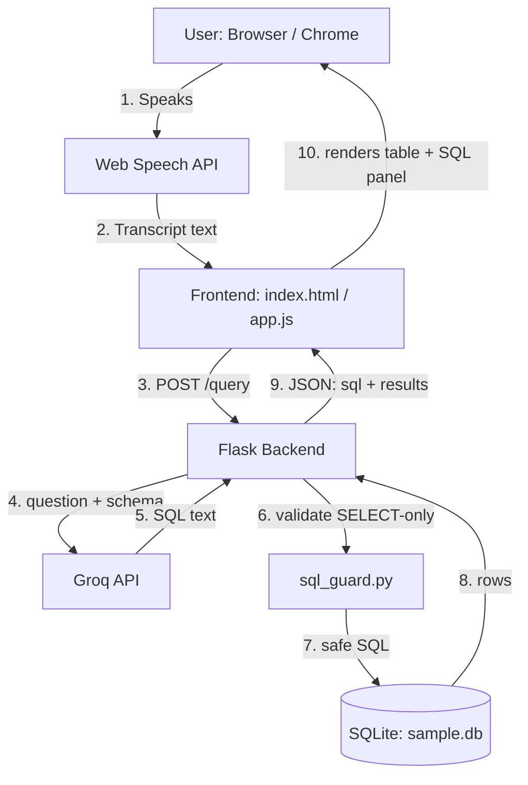
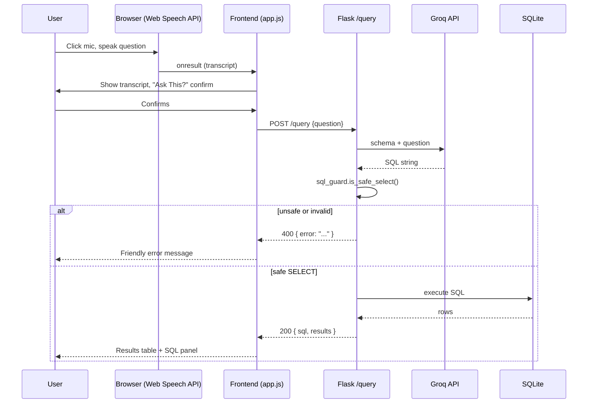
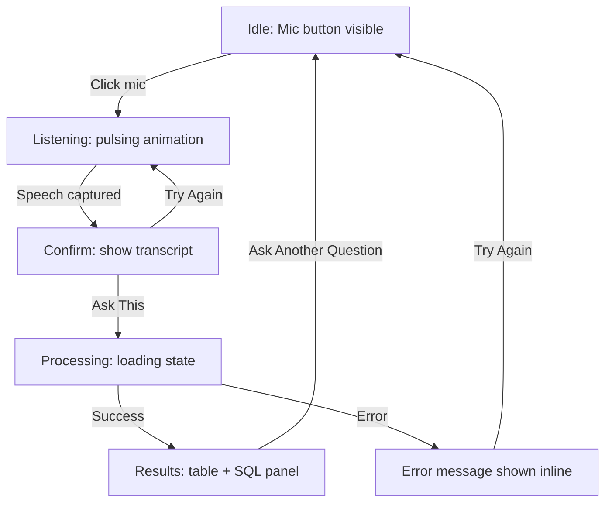

# VoiceSQL — System Architecture

Status: Finalized Day 2, **AI provider updated Day 4** (Claude → Groq, see `DAY4-SUMMARY.md` for why). This is the source of truth for how components interact. Do not change without re-approval.

## Component Diagram

## Request Lifecycle (Sequence)

## User Flow / State Machine

## Data Flow Summary

- **Client-side only:** voice capture and transcription via the Web Speech API. No audio data ever leaves the browser — only the transcribed text is sent to the backend.
- **Server-side:** the Flask backend receives text (the question), sends text to Groq (question + schema), receives text back (the SQL), validates it, and executes it locally against SQLite.
- **External services:** the Groq API is the only external network call in the entire request lifecycle. There are no other third-party services, no analytics, and no authentication providers in v1.0.

## AI Interaction

- Every `/query` call sends the **full database schema** (from `backend/schema.py`) alongside the user's question, so the AI model always has ground-truth table/column names.
- The system prompt instructs the model to return **only** a single SQL `SELECT` statement, no explanation, no markdown fences.
- The response is passed through `sql_guard.py` before ever touching the database — this is a hard boundary, not a suggestion. Any non-`SELECT` statement, or a `SELECT` containing a stacked statement, is rejected before execution.
- **Provider:** Groq API, model `openai/gpt-oss-20b`. Originally planned as the Claude API (Day 2), changed on Day 4 after hitting a hard paywall on Anthropic's API (no free tier) and persistent account-level permission issues on Google's Gemini API. See `docs/DAY4-SUMMARY.md` for the full troubleshooting history.

## External Services

| Service | Purpose | Data sent | Data received |
|---|---|---|---|
| Groq API | NL → SQL translation | Question text + schema text | SQL text only |
| Render (hosting) | Runs the Flask app publicly | N/A (infrastructure) | N/A |

No other external services are used in v1.0 (no analytics, no auth provider, no external database).
